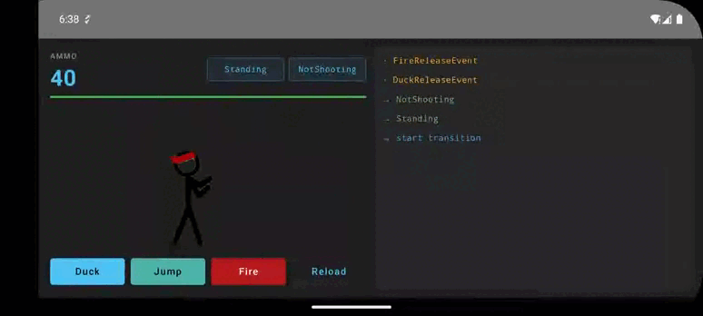

<div align="center">

# compose-kstatemachine-sample

**A Kotlin Multiplatform sample showing [KStateMachine](https://github.com/kstatemachine/kstatemachine) powering a 2D hero character**  
**in a Compose UI with a parallel state machine and MVI architecture**

---

[](https://github.com/KStateMachine/compose-kstatemachine-sample/actions)
[](https://kotlinlang.org/docs/multiplatform.html)
[](https://github.com/kstatemachine/kstatemachine)

---

[🎮 What it does](#-what-it-does) &nbsp;|&nbsp;
[🗺️ State machine](#️-state-machine) &nbsp;|&nbsp;
[🏗️ Architecture](#️-architecture) &nbsp;|&nbsp;
[🚀 Build & run](#-build--run)

</div>

---

## 🎮 What it does

Control a stick-figure hero through a set of **movement** and **fire** states using four on-screen buttons:

| Button | Action |
|---|---|
| **Jump** | Hero leaves the ground; auto-lands after 1 s |
| **Duck** (hold) | Hero crouches while held |
| **Fire** (hold) | Hero shoots at 50 ms intervals until ammo runs out |
| **Reload** | Restores ammo to 40 rounds |

The hero sprite updates in real time to reflect the current combination of movement + fire state. A live log panel shows every state entry, transition, and control event.

<p align="center">
  
</p>

---

## 🗺️ State machine

The machine runs with **`ChildMode.PARALLEL`** — two orthogonal regions are always active simultaneously.

```
Hero (PARALLEL root)
├── Movement
│   ├── Standing  ──JumpPress──►  Jumping
│   │                └──DuckPress──► AirAttacking
│   ├── Jumping   ──JumpComplete──► Standing
│   ├── Ducking   ──DuckRelease──► Standing
│   └── AirAttacking ──JumpComplete──► Ducking | Standing
└── Fire
    ├── NotShooting  ──FirePress [ammo > 0]──► Shooting
    └── Shooting     ──FireRelease | OutOfAmmo──► NotShooting
```

`activeStates` always contains exactly **two** `HeroState` values — one from each region — which the UI combines to pick the correct sprite.

> `AirAttacking` and `Shooting` are Kotlin `class` (not `object`) because they carry mutable instance state: `isDuckPressed` and `shootingTimer` respectively. All other states are `object` singletons.

---

## 🏗️ Architecture

**MVI + KStateMachine + Voyager + Koin**

```
UI (StickManGameScreen)
  → sendEvent(ControlEvent)
    → StickManGameScreenModel.machine.processEvent()   [KStateMachine]
      → onTransitionComplete / onStateEntry callbacks
        → intent { state { … } / sendEffect(…) }
          → MviModel.stateFlow / effectFlow
            → UI redraws
```

| Layer | Responsibility |
|---|---|
| `StateControl.kt` | Domain types — `ControlEvent` & `HeroState` sealed hierarchies |
| `StickmanGameScreenModel.kt` | Builds the machine; bridges KStateMachine → MVI |
| `Mvi.kt` | Generic `MviModel<State, Effect>` (StateFlow + Channel) |
| `ModelConst.kt` | Game constants and `ModelData` / `ModelEffect` types |
| `Timers.kt` | `singleShotTimer` & `tickerFlow` coroutine helpers |
| `StickManGameScreen.kt` | Compose UI; sprite selection via `List<HeroState>.hasState<T>()` |

Koin initialises automatically via **`androidx.startup`** — no custom `Application` subclass required.

---

## 🚀 Build & run

**Android**

```bash
./gradlew :composeApp:assembleDebug
# then install the APK or run directly from Android Studio
```

**iOS** — open `iosApp/iosApp.xcodeproj` in Xcode, or build the framework:

```bash
./gradlew :composeApp:linkDebugFrameworkIosSimulatorArm64
```

**All targets**

```bash
./gradlew build
```

---

## 🙏 Thanks to

[David Horner](https://github.com/davehorner)

---

<div align="center">

Licensed under the [MIT License](./LICENSE)

</div>
